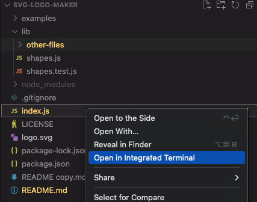

  # SVG Logo Maker
  
  ## Table of Contents
  1. [Instructions](#1-instructions)
  2. [Description](#2-description)
  3. [Contribution Guidelines](#3-contribution-guidelines)
  4. [Testing the Application](#4-testing-the-application)
  5. [License](#5-license)
  6. [Questions](#6-questions)

  ## 1. Instructions
  The application requires VS Code and at least Node 18.20.4, Node Package Manager 10.7.0, the Inquirer package 8.2.4, and Jest 29.7.0.

  ## 2. Description
  Once Node and NPM are installed, you will need to open the "index.js" file in the Integrated Terminal. To do this, right click on the filed and select "Open in Integrated Terminal". 
    
  
   
   
 In the VS Code terminal, you will just need to enter 'node index.js' and press enter. Doing so will let the application begin prompting the user for inputs.
 
  
   
   
  When the application prompts, you will need to enter the Logo Text (limited to 3 characters), the desired shape, and the color of the text and shape (can be hexidecimal color or general color name). Once all prompts are filled and submitted, the generated image will be saved under the Output folder. 
   
  
  
   
   
  Below is a link to a walkthrough video of the application: 
  https://drive.google.com/file/d/1jZqcsRjhbC_R1zeU-99SloVOX1TGM4WD/view

  ## 3. Contribution Guidelines
  This project is open source and available for other approved contributions.

  ## 4. Testing the Application
  Once Jest is installed through "npm install jest", you will then be able to test by entering the command "npm test" into the terminal. This will output if the test output matches to what would be output if the live function would create. 
    
  

  ## 5. License
  MIT 
  https://opensource.org/licenses/MIT

  ## 6. Questions:
  Contact me with questions at: 
    - Github: *jeremydray* 
    - Email: *jeremydray@gmail.com*
